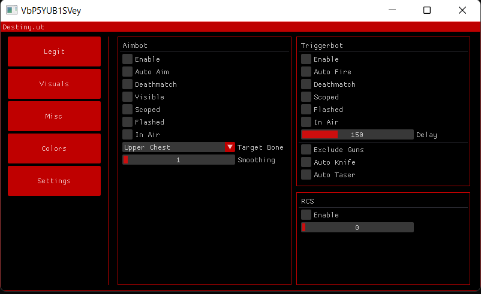

# Destiny.ut
 
 

> This is not a ready-to-use cheat and as such it is highly recommended that you do not use this

## Disclaimer
This program is for educational purposes only!

Copyright Disclaimer under section 107 of the Copyright Act 1976, allowance is made for “fair use” for purposes such as criticism, comment, news reporting, teaching, scholarship, education and research.

## Features
*   **Aimbot** - Aim Assistance
*   **Triggerbot** - Automatically fires when crosshair is on enemy
*   **RCS** - Automatic recoil control 
*   **Glow** - Render glow effect on players
*   **Color Chams** - Color player models to improve visibility
*   **Misc** - Miscellaneous features
*   **Customization** - Change the settings to your liking

### Media

## FAQ

### Will the cheat be updated in the future?
- There will most likely be no new features introduced, 
but bug fixes and code improvements can be expected

## Known Issues
- The aimbot doesn't manage to aim on the target before firing
- The visibility check is unreliable
- There is a possibility that the cheat will not work immediately after new CS:GO
  updates because the offsets have not yet been updated

## Credits
- [ocornut](https://github.com/ocornut) for [ImGui](https://github.com/ocornut/imgui)
- [GLFW-Team](https://github.com/glfw) for [GLFW](https://github.com/glfw/glfw)
- [nlohmann](https://github.com/nlohmann) for a modern C++ implementation of [JSON](https://github.com/nlohmann/json)
- [frk1](https://github.com/frk1) for providing offsets with [hazedumper](https://github.com/frk1/hazedumper)
- [Akandesh](https://github.com/Akandesh) for providing offsets with [blazedumper](https://github.com/Akandesh/blazedumper)
